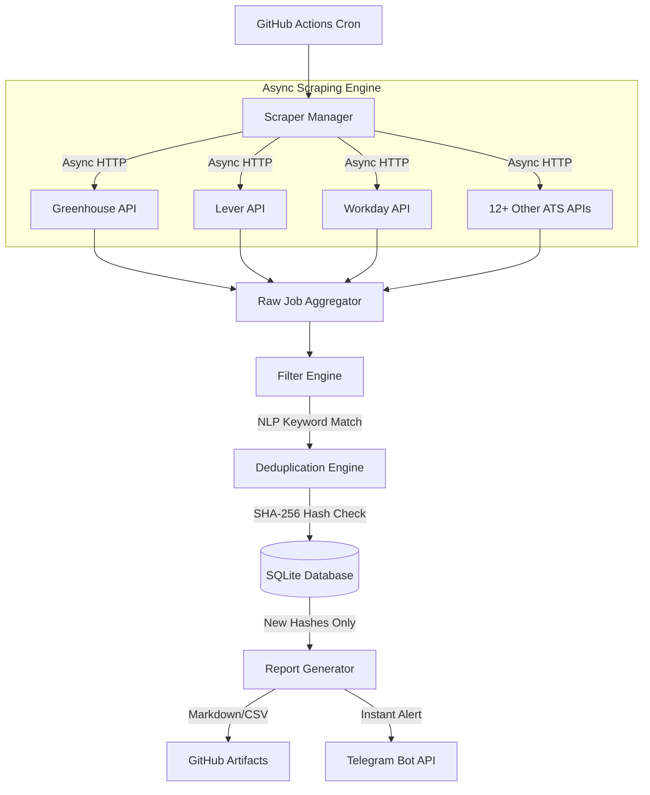

<div align="center">
  
# 🚀 AI/ML & Backend Software Engineering Job Discovery Pipeline

**An enterprise-grade, asynchronous web scraping and aggregation pipeline designed to discover freshly posted software engineering roles minutes after they hit official career pages.**

[](https://www.python.org/downloads/release/python-3120/)
[](https://docs.python.org/3/library/asyncio.html)
[](https://github.com/features/actions)
[](https://sqlite.org/index.html)
[](https://opensource.org/licenses/MIT)

</div>

---

## 📖 Overview

Traditional job boards (LinkedIn, Indeed) suffer from severe latency, ghost jobs, and extreme applicant saturation. To gain a competitive advantage in the AI/ML and Software Engineering space, I engineered a highly concurrent, fully automated pipeline that bypasses third-party boards entirely.

Instead, this system directly interrogates **300+ official company APIs** and Applicant Tracking Systems (ATS) to fetch raw JSON job data, applies strict NLP-based keyword filtering to isolate entry-level/fresher roles in targeted geographical areas (e.g., Bangalore), and delivers real-time notifications via Telegram.

## ✨ Technical Highlights

- **Massive Concurrency:** Replaced legacy synchronous HTML parsing (BeautifulSoup) with an `asyncio` & `aiohttp` architecture. The system aggressively manages network connections via `asyncio.Semaphore`, capable of querying and parsing 300+ enterprise endpoints in **under 30 seconds**.
- **Automated ATS API Discovery:** Eliminates the brittleness of DOM/CSS scraping. The `CompanyValidator` auto-detects 15+ underlying ATS providers (Greenhouse, Lever, Workday, BambooHR, etc.) from standard career URLs and dynamically invokes the correct native JSON API parser.
- **Smart Data Extraction:** Employs RegEx to automatically parse raw job descriptions for explicit salary figures (e.g., extracting "15 LPA") and format ATS posting dates cleanly into standard ISO strings for the Telegram alert payload.
- **Resilient Fault Tolerance:** Built for the wild. Features an SQLite-backed `source_health` monitoring system that tracks HTTP 403s (Cloudflare/Bot-protection) and timeouts. Implements exponential backoff, realistic browser header rotation, automatic `zstd` decoding, and gracefully disables blocking sources to prevent socket exhaustion without crashing the main thread.
- **Idempotent Deduplication:** Every discovered job undergoes SHA-256 hashing based on its unique attributes. The SQLite database ensures that historical jobs are tracked and filtered out, guaranteeing zero notification spam.
- **Zero-Touch Automation:** Deployed entirely on **GitHub Actions**. A scheduled cron workflow provisions an Ubuntu runner every **3 hours**, executes the pipeline, securely caches the SQLite state database across ephemeral runs, and pushes notifications seamlessly.

## 🏗️ System Architecture



## 🛠️ Technology Stack

| Category | Technology |
| :--- | :--- |
| **Core Language** | Python 3.12 |
| **Concurrency & Networking** | `asyncio`, `aiohttp`, `aiofiles` |
| **Data Parsing** | `beautifulsoup4` (for fallback XML feeds), standard `json` |
| **Database** | `aiosqlite` (Asynchronous SQLite) |
| **CI/CD & DevOps** | GitHub Actions, Actions Cache (State Persistence) |
| **Notifications** | Telegram Bot API |

## 🚀 Quick Start (Local Setup)

1. **Clone the repository:**
   ```bash
   git clone https://github.com/PiyushAgarwalcs/aiml_jobalert_bypa.git
   cd aiml_jobalert_bypa
   ```

2. **Install dependencies:**
   ```bash
   pip install -r requirements.txt
   ```

3. **Configure Environment Variables:**
   Rename `.env.example` to `.env` and add your Telegram credentials:
   ```env
   TELEGRAM_BOT_TOKEN="your_telegram_bot_token"
   TELEGRAM_CHAT_ID="your_telegram_chat_id"
   ```

4. **Execute the Pipeline:**
   To run the scraper and test filters locally without firing Telegram notifications:
   ```bash
   python main.py --dry-run
   ```

## 📈 Analytics & Reporting

Beyond Telegram alerts, the system maintains historical metrics:
- **Source Health Logging:** Tracks average API response times, timeout frequencies, and consecutive failures per company.
- **Run Summaries:** Generates `reports/jobs_latest.csv` and `broken_pages_report.md` on every execution to allow for continuous performance tuning.

## 📄 License
This project is open-source and available under the MIT License.
